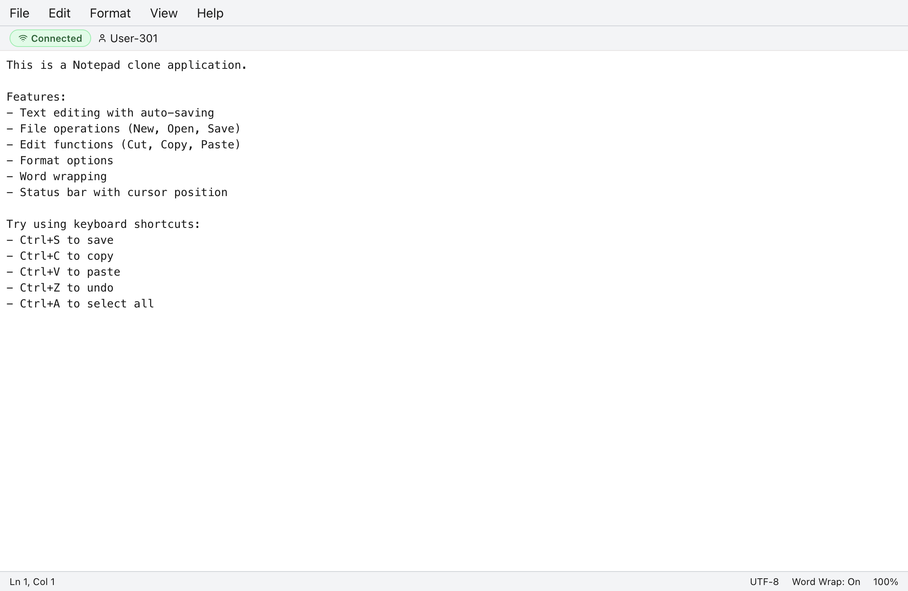

# Notepad with WebSockets

A collaborative, real-time notepad application that allows multiple users to edit documents simultaneously using WebSockets.

## Screenshots

### Main Application


## Features

- Create, edit, and delete text documents
- Real-time collaboration with multiple users
- Cursor position tracking
- Automatic document saving
- Modern and responsive UI

## Tech Stack

- **Frontend**: React, TypeScript, TailwindCSS, Shadcn UI components
- **Backend**: Express.js, WebSockets (ws)
- **Database**: Drizzle ORM with Neon Database (Serverless Postgres)
- **Build Tools**: Vite, esbuild, TypeScript

## Getting Started

### Prerequisites

- Node.js (v18+)
- npm or yarn

### Installation

1. Clone the repository:
   ```bash
   git clone https://github.com/yourusername/notepad-wss.git
   cd notepad-wss
   ```

2. Install dependencies:
   ```bash
   npm install
   # or
   yarn install
   ```

3. Set up the database:
   ```bash
   npm run db:push
   ```

### Running the Application

#### Development Mode

```bash
npm run dev
```

The server will start on port 3000 by default. You can access the application at [http://localhost:3000](http://localhost:3000).

#### Custom Port

You can specify a custom port using the PORT environment variable:

```bash
PORT=8080 npm run dev
```

#### Production Mode

Build the application:
```bash
npm run build
```

Start the production server:
```bash
npm start
```

In production mode, the application runs on port 5000 by default, unless overridden with the PORT environment variable.

## Project Structure

- `/server` - Backend Express.js server and WebSocket implementation
- `/src` - Frontend React application
- `/shared` - Shared types and schemas between frontend and backend

## WebSocket API

The application uses WebSockets for real-time communication. The WebSocket server is accessible at `/ws`.

### Message Types

- `join`: Join a document editing session
- `update`: Send document updates to other users
- `sync`: Receive the current state of a document
- `user_info`: Receive information about other users editing the document

## License

MIT 